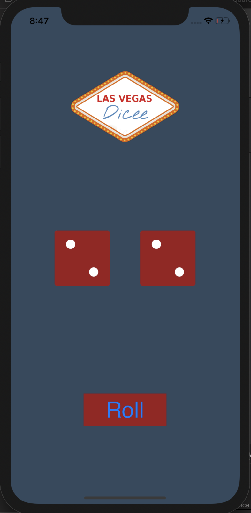
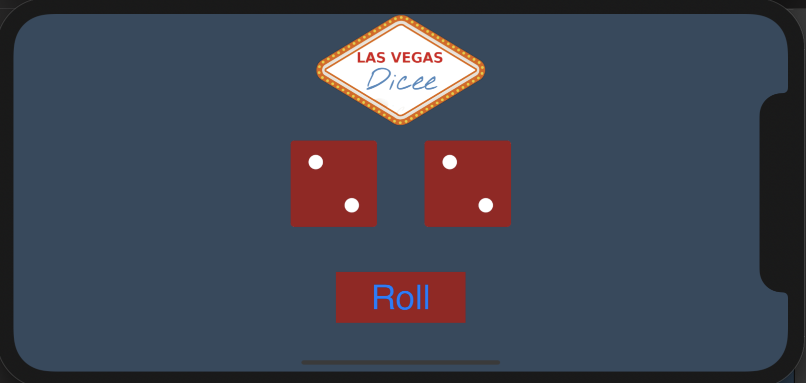

# FirstApp
Dice Roll iOS APP native

Applying the concepts:

* IBOutlets & IBActions
* Randomisation
* Motion Detection
* AutoLayouts

# Functionality
This App simulate two dice that you can roll and stop it

## Portrait

## Landscape

